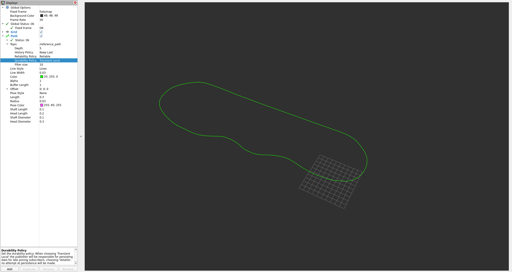

# fsds-autonomy

These are some ROS 2 (Humble) autonomy utilities for the FSDS (Formula Student Driverless Simulator), which can be found here: https://github.com/FS-Driverless/Formula-Student-Driverless-Simulator.

Please follow the guidance on the FSDS repo to set up the simulator and WSL here: https://fs-driverless.github.io/Formula-Student-Driverless-Simulator/v2.2.0/. I will not discuss how to set up their simulator here. Getting the ros2_bridge to work using WSL can be a bit finicky, I may update this sometime to cover this.

Important note: this is a work in progress and is not complete yet. This only creates a trajectory path from a CSV for now.

## What’s included
- `fsds_trajectory`: generates a deterministic centreline from FSDS cone CSV maps and publishes it as `nav_msgs/Path` on `/reference_path`.
- `tf_from_odom`: relays `/testing_only/odom` into dynamic TF so `fsds/map` exists for RViz.

## Requirements
- Ubuntu 22.04 running on WSL2
- ROS 2 Humble running on WSL2
- FSDS simulator running on Windows
- `fsds_ros2_bridge` running in WSL (publishing `/testing_only/odom`)
- A custom map CSV file. An example can be found in the FSDS repo: `maps/FormulaElectricBelgium`.

## How To Build
From your ROS 2 workspace root:
- colcon build --symlink-install
- source install/setup.bash

## How To Run
Remember to source ROS + your workspace!

Make sure the FSDS simulator is running, and `fsds_ros2_bridge` has successfully connected. You'll know it's connected because the arrow-key controls for the car will be disabled + there will be a message in the command-line. 

In one window run the `trajectory_publisher`:
- ros2 run fsds_trajectory trajectory_publisher --ros-args -p csv_path:=/your_path_to_csv_fle -p frame_id:=fsds/map

In another window run `tf_from_odom`:
- ros2 run fsds_trajectory tf_from_odom

Important note: Depending on your FSDS launch configuration, the odometry topic may be namespaced. I have tested this and on some systems the bridge publishes `/testing_only/odom`, while in others it publishes `fsds/testing_only/odom`.
You can overide the default `/testing_only/odom` by running this:
- ros2 run fsds_trajectory tf_from_odom --ros-args -p odom_topic:=/fsds/testing_only/odom

I will get around to updating `tf_from_odom` to automatically detect which odometry topic is being published to.

After you've done this, you can launch RVIZ2 in another window:
- Once open, set fixed frame to `fsds/map`.
- Click on add, and select path. Set topic to `reference_path`
- Set durability policy to transient local.

You SHOULD see a closed loop centreline which follows the circuit. This is your trajectory for MPC.

